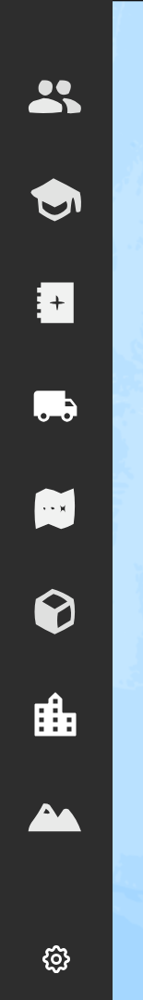

Barra lateral - Sidebar
=======================

A la izquierda de la pantalla se puede ver una barra lateral vertical que permite navegar entre categorías y subcategorías para activar o desactivar las capas predefinidas por el cliente desde **Layers Manager** y visualizarlas u ocultarlas.

Cada ícono representa una **categoría** distinta de capas, agrupadas por una temática en particular. Al hacer clic en una categoría, la barra se expandirá hacia la derecha y se abrirá el **panel de capas**, donde se podrán visualizar las **subcategorías**. 
Estas agrupan a las capas dentro de las categorías en torno a temáticas más específicas que las de las categorías o sub-temáticas.

Al hacer clic en una subcategoría, finalmente aparecerán las capas.

