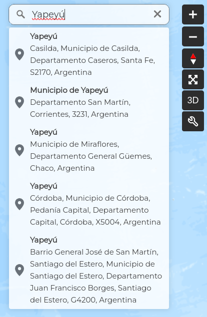

Buscador
========

El visor de Geoexpress cuenta con un buscador similar a los de Google Maps y Bing Maps, que sirve para encontrar ubicaciones exactas en el mapa. Para usarlo, se escribe el nombre del lugar en el buscador en la esquina superior derecha y se presiona Enter. Aparecerá una lista de opciones y, al seleccionar una, el mapa hará zoom en la ubicación elegida.

Acceso directo a GeoNode
------------------------

Este visor permite el acceso directo al GeoNode de Geoexpress de Kan https://geoexpress-demo.kan.com.ar mediante el logo de Kan que se encuentra en la parte inferior izquierda del visor. Al hacer clic en el logo, se redireccionará al usuario al GeoNode.

.. image:: images/search2.png
   :align: center

Si contamos con los permisos suficientes podremos cargar nuevas capas, en caso contrario podremos consultarlas.

.. image:: images/search3.png
   :align: center
